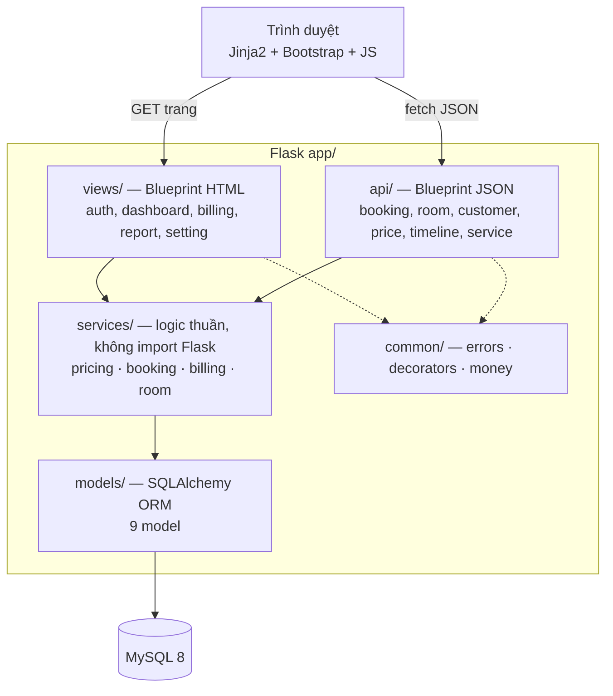
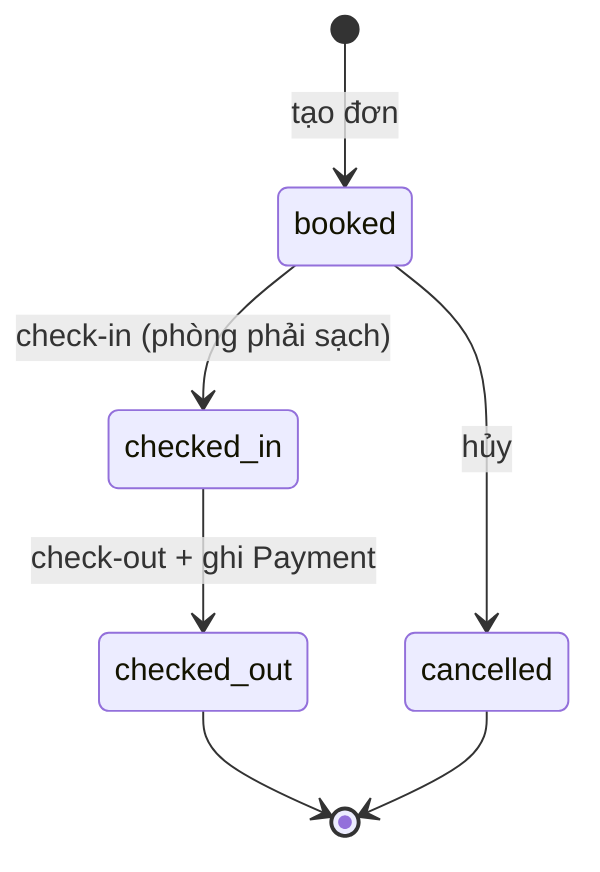
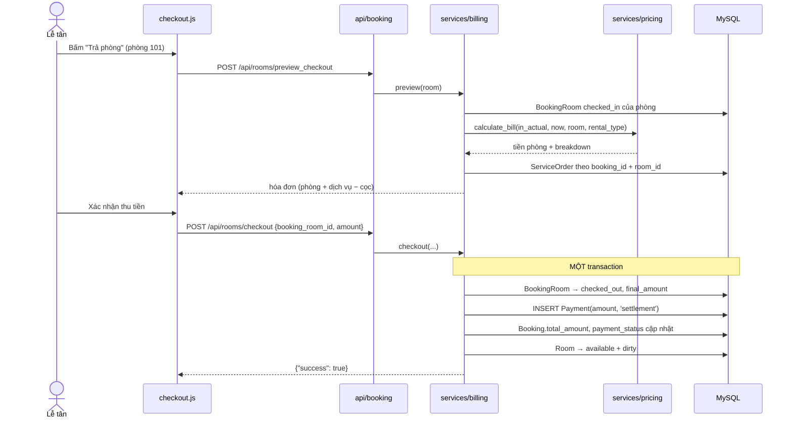
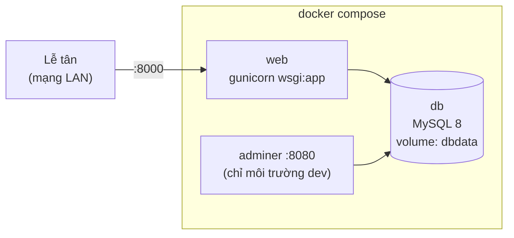

# Software Design Document — HotelPOS

**Hệ thống Quản lý Khách sạn (Hotel Management System)**

| | |
|---|---|
| Phiên bản | 1.0 |
| Ngày lập | 14/08/2026 |
| Người lập | minhduong101000 |
| Trạng thái | Draft — đồng bộ với Lộ trình Refactor P0–P5 |

> Tài liệu này mô tả thiết kế của hệ thống ở **hai trạng thái**: *hiện trạng* (codebase đang có) và *thiết kế đích* (sau khi hoàn tất lộ trình refactor). Nơi nào hai trạng thái khác nhau, tài liệu ghi rõ bằng nhãn `[Hiện trạng]` / `[Đích]`.

---

## 1. Giới thiệu

### 1.1. Mục đích

Tài liệu cung cấp thiết kế kiến trúc, dữ liệu, API và nghiệp vụ của HotelPOS — phần mềm quản lý vận hành khách sạn quy mô nhỏ (10–100 phòng) cho lễ tân và quản lý. Đối tượng đọc: lập trình viên tham gia phát triển, người review, và người bảo trì về sau.

### 1.2. Phạm vi hệ thống

**Trong phạm vi:**

- Sơ đồ phòng thời gian thực (trạng thái phòng, khách đang ở, khách sắp đến)
- Timeline đặt phòng kéo-thả (Vis.js)
- Đặt phòng lẻ và đặt phòng đoàn (nhiều phòng / một đơn)
- Check-in, check-out, tính hóa đơn (thuê giờ / thuê ngày, phụ thu, giá lễ tết)
- Gọi dịch vụ / minibar theo phòng
- Quản lý khách hàng, dịch vụ, luật giá
- Đăng nhập, phân quyền admin / staff

**Ngoài phạm vi (màn hình đã dựng khung, chưa có logic):** thu ngân tập trung, kho hàng, giao ca, báo cáo doanh thu, cấu hình hệ thống.

### 1.3. Thuật ngữ

| Thuật ngữ | Nghĩa |
|---|---|
| **Booking** | Đơn đặt phòng tổng (header) — một đơn cho một khách/đoàn, có thể gồm nhiều phòng |
| **BookingRoom** | Dòng chi tiết: một phòng cụ thể trong một Booking, mang thời gian in/out riêng |
| **ServiceOrder** `[Đích]` | Dòng dịch vụ khách đã gọi (hiện trạng tên là `BookingService`) |
| **PriceRule** | Luật giá theo thời điểm (lễ, tết, cuối tuần) ghi đè giá ngày niêm yết |
| **Thuê giờ / Thuê ngày** | `rental_type = hourly` / `daily` — hai chế độ tính tiền |
| **Giờ chuẩn** | Check-in 14:00, check-out 12:00 (chế độ thuê ngày) |

### 1.4. Tài liệu liên quan

- Lộ trình Refactor P0–P5 (artifact): `https://claude.ai/code/artifact/d5b0acb7-b4d0-4bad-a2ae-2ad1a2543637`

---

## 2. Tổng quan hệ thống

### 2.1. Stack công nghệ

| Tầng | Công nghệ |
|---|---|
| Backend | Python 3, Flask, Flask-SQLAlchemy, Flask-Login, Flask-Migrate |
| CSDL | MySQL 8 (driver PyMySQL) |
| Frontend | Server-rendered Jinja2 + Bootstrap 5, vanilla JS gọi API JSON, Vis.js cho timeline |
| Triển khai `[Đích]` | Docker Compose: `web` (gunicorn) + `db` (MySQL) + `adminer` |

### 2.2. Tác nhân (Actors)

| Actor | Quyền | Chức năng chính |
|---|---|---|
| **Lễ tân (staff)** | Đăng nhập | Sơ đồ phòng, timeline, đặt phòng, check-in/out, gọi dịch vụ, khách hàng |
| **Quản lý (admin)** | Toàn quyền | Tất cả của staff + quản lý giá, dịch vụ, nhân viên, báo cáo |

`[Hiện trạng]` Cột `User.role` tồn tại nhưng chưa được kiểm tra ở bất kỳ endpoint nào — staff và admin ngang quyền. `[Đích]` decorator `@role_required('admin')` áp cho nhóm quản lý giá, dịch vụ, cấu hình.

### 2.3. Đặc tính phi chức năng

- **Quy mô:** một cơ sở, ≤ 100 phòng, ≤ 10 người dùng đồng thời. Không cần cache/queue.
- **Tính đúng của tiền là ưu tiên số 1** — mọi phép tính tiền dùng `Decimal`, mọi giao dịch ghi sổ `payments`.
- **Chống double-booking** ở tầng DB (constraint + khóa hàng), không chỉ ở tầng ứng dụng.
- Ngôn ngữ giao diện: tiếng Việt. Múi giờ: giờ máy chủ (một cơ sở, không cần TZ-aware).

---

## 3. Kiến trúc

### 3.1. Kiến trúc tổng thể `[Đích]`

Monolith Flask 3 tầng, tách theo **loại response** chứ không chỉ theo domain:



**Quy tắc phụ thuộc (một chiều):** `views/api → services → models`. Tầng `services/` không được import Flask (`request`, `jsonify`, `session`) — nhờ đó test được bằng unit test thuần, không cần app context giả lập request.

### 3.2. Vì sao tách `api/` khỏi `views/`

Hai loại blueprint khác nhau ở **cách xử lý lỗi xác thực**:

```python
@login_manager.unauthorized_handler
def unauthorized():
    if request.blueprint and request.blueprint.startswith("api"):
        return jsonify(error="unauthenticated"), 401   # JS xử lý được
    return redirect(url_for("auth.login"))              # trình duyệt
```

`[Hiện trạng]` mọi `@login_required` đều redirect 302 về trang login HTML — `fetch()` phía client nhận HTML, `res.json()` vỡ âm thầm, lễ tân thấy màn hình trống khi hết session. Đây là bug thật, không phải tái cấu trúc cho đẹp.

### 3.3. Cấu trúc thư mục `[Đích]`

```
hotel_management_system/
├── docker-compose.yml
├── docker/Dockerfile
├── .env.example
├── wsgi.py                    # entrypoint gunicorn
├── migrations/                # Flask-Migrate
├── app/
│   ├── __init__.py            # create_app(config_name)
│   ├── config.py              # BaseConfig / Dev / Test / Prod
│   ├── extensions.py          # db, login_manager, migrate, csrf
│   ├── models/
│   ├── services/
│   ├── api/
│   ├── views/
│   ├── common/
│   ├── templates/
│   └── static/
└── tests/
    ├── conftest.py            # fixture app / client / db_session
    ├── test_smoke.py
    ├── test_pricing.py
    └── test_booking_flow.py
```

`[Hiện trạng]` controllers/ trộn cả view HTML lẫn API JSON lẫn service (`pricing_service.py`); `app` tạo ở cấp module nên không viết test được. Xem Lộ trình Refactor P2–P3.

---

## 4. Thiết kế dữ liệu

### 4.1. Sơ đồ quan hệ (ERD)

```mermaid
erDiagram
    CUSTOMER ||--o{ BOOKING : "dat phong"
    BOOKING  ||--|{ BOOKING_ROOM : "gom"
    BOOKING  ||--o{ SERVICE_ORDER : "goi dich vu"
    BOOKING  ||--o{ PAYMENT : "ghi so"
    ROOM     ||--o{ BOOKING_ROOM : "duoc xep"
    ROOM     ||--o{ SERVICE_ORDER : "phat sinh tai"
    SERVICE  ||--o{ SERVICE_ORDER : "duoc goi"

    CUSTOMER {
        int id PK
        string name
        string phone UK
        string email UK
        string cccd UK
        string address
    }
    BOOKING {
        int id PK
        string code UK "BK-yymmdd-XXXX"
        int customer_id FK
        decimal total_amount
        decimal prepaid_amount
        string payment_status "unpaid/partial/paid/refunded"
        string status "pending/confirmed/checked_in/completed/cancelled"
        string source "walk_in/phone/ota"
        string note
    }
    BOOKING_ROOM {
        int id PK
        int booking_id FK
        int room_id FK
        datetime check_in_expected
        datetime check_out_expected
        datetime check_in_actual
        datetime check_out_actual
        string rental_type "daily/hourly"
        decimal price_snapshot "gia chot luc dat"
        decimal final_amount "tien phong chot luc tra"
        string status "booked/checked_in/checked_out/cancelled"
    }
    ROOM {
        int id PK
        string room_number UK
        string room_type "Standard/Deluxe/Suite"
        decimal price_per_night
        decimal price_initial_block "gia block gio dau"
        int initial_hours "so gio cua block dau"
        decimal price_next_hour
        string status "available/occupied/maintenance"
        string clean_status "cleaned/dirty"
    }
    SERVICE_ORDER {
        int id PK
        int booking_id FK
        int room_id FK "phong nao goi"
        int service_id FK
        int quantity
        decimal price_at_booking "gia chot luc goi"
    }
    SERVICE {
        int id PK
        string name
        decimal price
    }
    PAYMENT {
        int id PK
        int booking_id FK
        int created_by FK "user ghi nhan [Dich]"
        decimal amount
        string payment_method "cash/banking/card"
        string payment_type "deposit/settlement/refund"
        datetime created_at
    }
    PRICE_RULE {
        int id PK
        string name
        string room_type "khop theo loai phong"
        int priority "cao thang"
        date start_date "nullable"
        date end_date "nullable"
        string days_of_week "vd 5,6 = T7,CN"
        decimal price_daily
        bool is_active
    }
```



`PRICE_RULE` không có khóa ngoại — khớp với phòng qua `room_type` tại thời điểm tính giá.

### 4.2. Quyết định thiết kế dữ liệu

| # | Quyết định | Lý do |
|---|---|---|
| D1 | Tách `Booking` (header) / `BookingRoom` (line) | Hỗ trợ đặt đoàn: một đơn, nhiều phòng, mỗi phòng in/out độc lập |
| D2 | Snapshot giá (`price_snapshot`, `price_at_booking`) | Giá đóng băng tại thời điểm đặt/gọi — đổi giá niêm yết không làm sai hóa đơn cũ |
| D3 | `Payment` là **sổ ghi chép append-only** | Mọi lần thu/chi tiền là một dòng; không sửa/xóa, sai thì ghi dòng `refund`. `total_amount` và `payment_status` trên Booking là số liệu suy ra (denormalized), cập nhật cùng transaction |
| D4 | Tiền dùng `DECIMAL(15,2)` + Python `Decimal` | `[Hiện trạng]` trộn `Integer`/`Numeric`/`float` — sai số làm tròn. Helper tập trung tại `common/money.py` |
| D5 | Tên bảng thống nhất `snake_case` số nhiều | `[Hiện trạng]` bảng `Users` viết hoa — vỡ trên Linux (`lower_case_table_names=0`). Đổi thành `users` trong migration đầu |
| D6 | Đổi tên `BookingService` → `ServiceOrder` | Tránh đụng tên với tầng `services/` khi đọc import |
| D7 | Schema quản lý bằng Flask-Migrate | `[Hiện trạng]` dựa vào `db.create_all()` — không có đường nâng cấp schema khi đã có dữ liệu |

### 4.3. Ràng buộc toàn vẹn `[Đích]`

- `bookings.code` — UNIQUE, sinh dạng `BK-yymmdd-XXXX` (4 ký tự từ bảng chữ không nhập nhằng `ABCDEFGHJKLMNPQRSTUVWXYZ23456789`).
- Chống double-booking: kiểm tra chồng lấn `(check_in_expected < :out) AND (check_out_expected > :in)` với `status IN ('booked','checked_in')`, thực hiện **trong transaction có `SELECT … FOR UPDATE` trên phòng liên quan**. Kiểm tra ở tầng app đơn thuần (hiện trạng) thua race condition khi hai lễ tân thao tác cùng lúc.
- `service_orders.room_id` — NOT NULL: dịch vụ luôn gắn với một phòng cụ thể, để check-out lẻ từng phòng trong đoàn tính đúng tiền.
- Index: `booking_rooms(room_id, status)`, `booking_rooms(check_in_expected)`, `price_rules(room_type, is_active)`.

### 4.4. Máy trạng thái

**BookingRoom** (mỗi phòng trong đơn đi độc lập):



**Booking** (suy ra từ các dòng con): `pending → confirmed → checked_in → completed` — chuyển sang `completed` khi **tất cả** BookingRoom đã `checked_out`/`cancelled`.

**Room** — hai trục trạng thái độc lập, hiển thị gộp:

| `status` \ `clean_status` | `cleaned` | `dirty` |
|---|---|---|
| `available` | 🟢 Trống — nhận khách được | 🟡 Chờ dọn — **chặn check-in** |
| `occupied` | 🔴 Có khách | 🔴 Có khách |
| `maintenance` | ⚫ Bảo trì | ⚫ Bảo trì |

Quy tắc chuyển: check-in → `occupied`; check-out → `available` + `dirty` (đồng thời); xác nhận dọn phòng → `cleaned` (chỉ set `available` nếu không còn khách và không bảo trì).

---

## 5. Thiết kế API

Chuẩn chung: response JSON dạng `{"success": bool, "msg": str, ...data}`; lỗi xác thực trả `401` (API) / redirect (view); lỗi hệ thống trả `500` với message chung — **không trả `str(e)`** ra client (handler tập trung tại `common/errors.py`).

### 5.1. Xác thực & phân quyền

| Method | Endpoint | Mô tả | Quyền |
|---|---|---|---|
| GET/POST | `/login` | Đăng nhập (CSRF-protected) | Công khai |
| GET | `/logout` | Đăng xuất | Đăng nhập |

### 5.2. Phòng & sơ đồ phòng

| Method | Endpoint | Mô tả | Quyền |
|---|---|---|---|
| GET | `/dashboard/room-map` | Trang sơ đồ phòng | Đăng nhập |
| GET | `/api/rooms` | Toàn bộ phòng + trạng thái + khách đang ở/sắp đến + giá hiệu lực + thống kê | Đăng nhập |
| POST | `/api/rooms/clean` | Xác nhận đã dọn phòng | Đăng nhập |
| POST | `/api/rooms/search` | Tìm phòng trống theo khoảng ngày, gom theo loại, kèm giá đã áp rule | Đăng nhập |

### 5.3. Đặt phòng & lưu trú

| Method | Endpoint | Mô tả | Quyền |
|---|---|---|---|
| POST | `/api/bookings/group_create` | Tạo đơn đoàn/lẻ: 1 Booking + N BookingRoom, check trùng lịch từng phòng | Đăng nhập |
| POST | `/api/bookings/create` | Tạo đơn từ modal timeline (có thể check-in ngay) | Đăng nhập |
| GET | `/api/bookings/upcoming/<room_id>` | Đơn `booked` gần nhất của phòng | Đăng nhập |
| GET | `/api/bookings/<id>` | Chi tiết một BookingRoom (modal sửa) | Đăng nhập |
| POST | `/api/bookings/update_timeline` | Kéo-thả đổi phòng / kéo dãn đổi giờ trên timeline | Đăng nhập |
| GET | `/api/bookings/timeline` | Dữ liệu Vis.js: groups (phòng) + items (BookingRoom, màu theo trạng thái) | Đăng nhập |
| POST | `/api/rooms/checkin` | Check-in: chặn nếu phòng bẩn; ghi `check_in_actual`; phòng → `occupied` | Đăng nhập |
| POST | `/api/rooms/preview_checkout` | Xem trước hóa đơn: tiền phòng (mục 6) + dịch vụ **của phòng đó** − cọc | Đăng nhập |
| POST | `/api/rooms/checkout` | Chốt trả phòng: ghi `final_amount`, ghi dòng `Payment`, cập nhật `payment_status`, phòng → `available`+`dirty` | Đăng nhập |

### 5.4. Dịch vụ / minibar

| Method | Endpoint | Mô tả | Quyền |
|---|---|---|---|
| POST | `/api/orders/add` | Gọi dịch vụ cho phòng đang ở (cộng dồn theo `booking_id + room_id + service_id`) | Đăng nhập |
| POST | `/api/bookings/update_service_quantity` | Tăng/giảm số lượng một dòng dịch vụ | Đăng nhập |
| POST | `/api/bookings/update_services` | Thay danh sách dịch vụ **của một phòng** trước check-out | Đăng nhập |
| GET | `/api/services` | Danh mục dịch vụ | Đăng nhập |
| POST/PUT/DELETE | `/api/services[/<id>]` | CRUD danh mục dịch vụ | **Admin** |

### 5.5. Khách hàng

| Method | Endpoint | Mô tả | Quyền |
|---|---|---|---|
| GET | `/api/customers?q=` | Tìm theo tên / SĐT / CCCD (`ilike`, giới hạn 100) | Đăng nhập |
| POST/PUT/DELETE | `/api/customers[/<id>]` | CRUD khách hàng | Đăng nhập |

`[Hiện trạng]` toàn bộ nhóm này **không có** `@login_required` — bắt buộc bổ sung (Roadmap P1).

### 5.6. Quản lý giá

| Method | Endpoint | Mô tả | Quyền |
|---|---|---|---|
| GET | `/api/prices/all-data` | Giá niêm yết từng phòng + danh sách PriceRule | **Admin** |
| POST | `/api/prices/update-base` | Sửa giá niêm yết một phòng | **Admin** |
| POST | `/api/prices/save-rule` | Tạo/sửa luật giá | **Admin** |
| DELETE | `/api/prices/delete-rule/<id>` | Xóa luật giá | **Admin** |

---

## 6. Thiết kế nghiệp vụ: engine tính giá

Toàn bộ nằm trong `services/pricing.py` — hàm thuần, đầu vào là dữ liệu, đầu ra là số tiền + breakdown, **không chạm DB session ngoài truy vấn PriceRule**. Đây là module được test đầu tiên (Roadmap P4).

### 6.1. Giá hiệu lực — `get_effective_room_prices(room, date)`

1. Lấy giá gốc từ `Room`: `price_per_night`, `price_initial_block`, `initial_hours`, `price_next_hour`.
2. Tìm `PriceRule` khớp: cùng `room_type`, `is_active`, ngày nằm trong `[start_date, end_date]` — `[Đích]` rule để trống ngày nghĩa là áp quanh năm, query phải dùng `or_(start_date.is_(None), start_date <= d)` (hiện trạng so sánh thẳng với NULL nên rule không ngày **không bao giờ khớp**).
3. Lọc tiếp theo `days_of_week` (chuỗi `"5,6"`, weekday Python 0=T2). Lấy rule `priority` cao nhất.
4. Rule **chỉ ghi đè giá ngày** — giá giờ luôn theo niêm yết của phòng.

### 6.2. Thuê giờ — tính theo block

```
GRACE = 10 phút
nếu thời_lượng ≤ initial_hours + GRACE:
    tiền = price_initial_block                     # ví dụ: 2h đầu
ngược lại:
    giờ_tính = ceil((phút − GRACE) / 60)
    tiền = price_initial_block + (giờ_tính − initial_hours) × price_next_hour
```

**Trần giá (ceiling check):** nếu tiền giờ > giá 1 đêm hiệu lực → tự động chuyển sang tính theo ngày (có ghi dòng giải thích trong breakdown). Khách không bao giờ trả tiền giờ đắt hơn tiền đêm.

### 6.3. Thuê ngày — đêm + phụ thu

- `số_đêm = (ngày_out − ngày_in)`, tối thiểu 1. Giờ chuẩn 14:00 → 12:00.
- Phụ thu nhận sớm (trước 14:00) và trả muộn (sau 12:00), tính trên giá đêm hiệu lực:

| Chênh lệch giờ | Phụ thu |
|---|---|
| ≤ 1h | Miễn phí (ân hạn) |
| 1h – 4h | 30% giá đêm |
| 4h – 6h | 50% giá đêm |
| > 6h | 100% giá đêm |

### 6.4. Luồng check-out (sequence)



`[Hiện trạng]` bước ghi `Payment` và cập nhật `total_amount`/`payment_status` **chưa tồn tại** — tiền khách trả bị gán vào thuộc tính không phải cột (`booking_room.price`) và biến mất. Đây là fix quan trọng nhất của P5.

### 6.5. Quy tắc dịch vụ trong đơn đoàn

Mọi thao tác đọc/ghi dịch vụ phải lọc theo **cả** `booking_id` **và** `room_id`. Hệ quả: xem hóa đơn phòng 101 chỉ thấy dịch vụ phòng 101; sửa dịch vụ phòng 101 không được xóa dịch vụ phòng 102 cùng đoàn (`[Hiện trạng]` đang `delete()` theo `booking_id` — mất dữ liệu cả đoàn).

---

## 7. Thiết kế bảo mật

| Hạng mục | Thiết kế `[Đích]` | Hiện trạng |
|---|---|---|
| Mật khẩu | Hash Werkzeug (`pbkdf2`), không lưu plaintext | ✅ Đã đúng |
| Secret / DB credentials | Đọc từ `.env`, không nằm trong source; đổi mật khẩu MySQL đã lộ trong lịch sử git | ❌ Hardcode trong `app.py` |
| Backdoor demo login | Không tồn tại | ❌ `admin/123456` vào được không cần DB |
| `/init-db` | Bỏ route; thay bằng lệnh CLI `flask seed-admin` chạy trong container | ❌ Route công khai |
| Xác thực API | 100% endpoint (trừ `/login`) sau `@login_required`; API trả 401 JSON | ❌ Nhóm customers hở hoàn toàn |
| Phân quyền | `@role_required('admin')` cho giá / dịch vụ / cấu hình | ❌ Chưa dùng `role` |
| CSRF | Flask-WTF `CSRFProtect` toàn cục; JS gửi `X-CSRFToken` từ meta tag | ❌ Chưa có |
| Rò rỉ lỗi | Handler tập trung, log server-side (`logging`), client nhận message chung | ❌ `str(e)` trả thẳng ra client (~12 chỗ) |
| Debug | `debug=True` chỉ trong `DevConfig`; prod chạy gunicorn | ❌ Bật cứng |

---

## 8. Thiết kế triển khai

### 8.1. Topology `[Đích]`



- `db` có healthcheck (`mysqladmin ping`); `web` `depends_on: condition: service_healthy`.
- Migration chạy lúc khởi động container web: `flask db upgrade && gunicorn ...`.
- Backup: `mysqldump` theo lịch ra volume/host — dữ liệu đặt phòng là tài sản duy nhất không dựng lại được.

### 8.2. Biến môi trường

| Biến | Ví dụ | Ghi chú |
|---|---|---|
| `FLASK_CONFIG` | `production` | Chọn class config |
| `SECRET_KEY` | *(random 32+ bytes)* | Bắt buộc, không có default ở prod |
| `DATABASE_URL` | `mysql+pymysql://hotel:***@db/hotel` | User riêng, **không dùng root** |
| `MYSQL_ROOT_PASSWORD` / `MYSQL_DATABASE` / `MYSQL_USER` / `MYSQL_PASSWORD` | — | Cho container `db` |

Cam kết: `git clone` + điền `.env` + `docker compose up` = hệ thống chạy trên máy trắng. Đây là tiêu chí nghiệm thu của Roadmap P1.

---

## 9. Thiết kế kiểm thử

| Tầng | Phạm vi | File |
|---|---|---|
| Smoke | Duyệt `app.url_map`, mọi route GET không trả 500 | `test_smoke.py` (viết ở P2.5, là lưới an toàn cho việc dời file P3) |
| Unit | `services/pricing.py`: block giờ, ân hạn 10′, trần giờ→ngày, phụ thu theo bậc, rule không ngày, rule theo thứ, priority | `test_pricing.py` |
| Integration | Luồng: đặt đoàn → check-in → gọi dịch vụ → preview → check-out; assert `Payment` được ghi, `payment_status` đúng, phòng về `dirty`; test chống double-booking | `test_booking_flow.py` |

Fixture: `TestConfig` dùng SQLite in-memory (hoặc MySQL test container nếu cần test constraint), mỗi test chạy trong transaction rollback.

---

## 10. Vấn đề đã biết & nợ kỹ thuật

Chi tiết đầy đủ nằm trong báo cáo đánh giá + Lộ trình Refactor. Tóm tắt các mục ảnh hưởng thiết kế:

| # | Vấn đề | Xử lý tại |
|---|---|---|
| 1 | `group_create` dùng kwarg không tồn tại (`booking_date`, `deposit`, `rental_type`, `price`) → crash | P5 (viết lại trên tầng service) |
| 2 | Tiền check-out không được ghi vào đâu; bảng `payments` chưa từng có dữ liệu | P5 — mục 6.4 |
| 3 | `ServiceOrder` thiếu `room_id` ở 2/3 đường ghi → IntegrityError | P5 — mục 6.5 |
| 4 | PriceRule không ngày không bao giờ khớp (so sánh NULL) | P5 — mục 6.1 |
| 5 | Bảng `Users` viết hoa — vỡ trên Linux/Docker | P1 (migration đầu) |
| 6 | `models/__init__.py` export thiếu 3/9 model — mapper sống nhờ thứ tự import | P2 |
| 7 | 5 màn hình dữ liệu cứng (thu ngân, kho, giao ca, báo cáo, cấu hình) | Sau P5, ưu tiên thu ngân + báo cáo (đọc từ `payments`) |

---

*Tài liệu được cập nhật theo tiến độ refactor; mục nào chuyển từ `[Đích]` thành hiện thực thì gỡ nhãn.*
